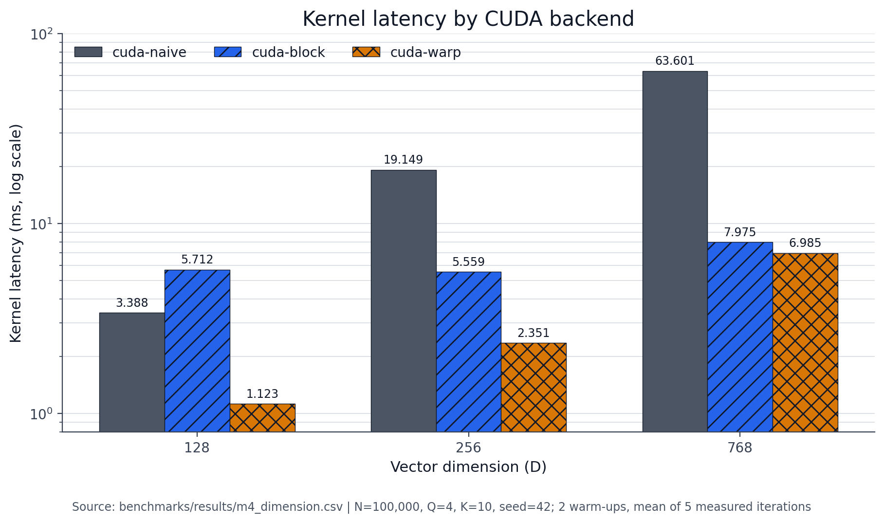
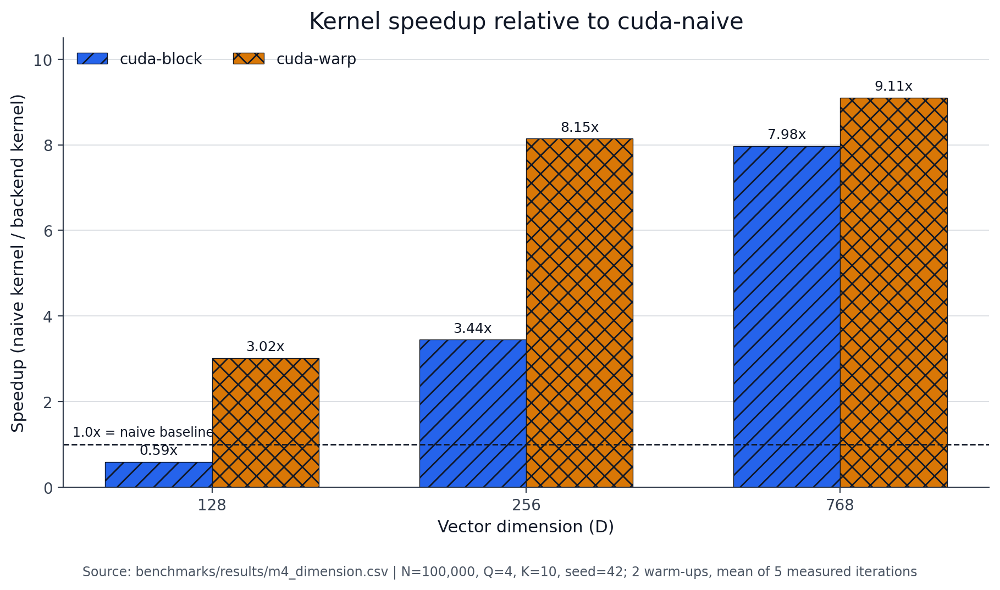

# CUDA-Accelerated Vector Search Engine

## Overview

This repository is a profiling-driven implementation of exact vector
similarity search in C++17 and CUDA C++. It computes FP32 dot-product
similarities for normalized vectors, uses a deterministic serial CPU backend as
the correctness reference, and preserves each CUDA design as a separate
backend so the optimization path remains reproducible.

The project develops from a deliberately naive CUDA mapping to coalesced
block- and warp-level reductions, then addresses the next system bottleneck by
keeping an unchanged database resident on the GPU. CPU Top-K is intentionally
shared by every backend so the kernel and data-lifecycle experiments stay
controlled.

## Key Results

The headline result is a **9.316x kernel speedup** at
`N=100,000, D=768, Q=4, K=10`: the warp primary run reduced similarity-kernel
latency from **64.447 ms** to **6.918 ms**.

| Backend | Work mapping | D=768 kernel latency | Speedup vs naive |
| --- | --- | ---: | ---: |
| `cpu` | Serial correctness reference | Not a CUDA kernel | — |
| `cuda-naive` | One thread per vector pair | 64.447 ms | 1.000x |
| `cuda-block` | One block per vector pair | 7.879 ms | 8.180x |
| `cuda-warp` | One warp per vector pair | 6.918 ms | 9.316x |
| `cuda-warp-resident` | Warp kernel + persistent GPU database | Same warp kernel design | See resident-mode caveat below |

These kernel values come from the single warp primary comparison in
[`warp_primary.csv`](benchmarks/results/warp_primary.csv): Release build, two
warm-ups, five measured iterations, normalized FP32 data, and seed 42.
Dataset generation is excluded. The resident experiment was a separate
system-level run and is not mixed into this kernel-speedup calculation.



## Optimization Journey

```text
CPU reference
    ↓
Naive CUDA
    ↓
Stage timing + Nsight Compute
    ↓
Block per vector
    ↓
Warp per vector
    ↓
GPU-resident database
```

### CPU reference

The serial backend established deterministic dataset generation, FP32 dot
products, stable Top-K ordering, and the correctness oracle used by every CUDA
test. This made later performance changes measurable without relaxing result
quality.

### Naive CUDA baseline

The first CUDA backend assigned one complete query/database-vector pair to one
thread. It was correct and simple, but each thread walked all `D` dimensions
serially and adjacent threads loaded different row-major vectors.

### Pipeline timing

The unchanged naive pipeline was decomposed into allocation, database/query
H2D, kernel, score D2H, CPU Top-K, and cleanup. At `100K x 768`, the kernel
was the largest measured stage at 64.144 ms (58.3% of instrumented E2E), while
database H2D was 31.888 ms (29.0%).

### Nsight Compute diagnosis

Profiling confirmed the suspected memory-access problem: global loads used only
4 of 32 bytes per sector, and the kernel spent most scheduler cycles with no
eligible warp while LG-memory queue and L1TEX scoreboard stalls dominated.
This evidence selected a coalesced, dimension-parallel mapping as the next
experiment.

### Block per vector

One 256-thread block was assigned to each pair. Threads loaded adjacent
dimensions and reduced partial sums through shared memory. Global-load sector
use improved to 32/32 bytes and the primary D=768 kernel fell to 7.879 ms, but
the full-block reduction regressed at D=128.

### Warp per vector

One warp was assigned to each pair, with lanes walking dimensions and
`__shfl_down_sync` performing the reduction. It preserved 32/32-byte load
use, removed the block-wide shared-memory/barrier reduction, recovered small-D
performance, and reached 6.918 ms on the primary D=768 run.

### GPU-resident database

Once kernel execution was about 6.9 ms, repeatedly allocating and uploading
the unchanged database became the system-level target. The resident backend
uploads the database during preparation and reuses it across query batches.
Cold searches still pay preparation and were slower in the recorded one-shot
runs; warm-query gains are therefore reported separately and are not presented
as startup speedups.

## Why Naive CUDA Was Slow

Vectors are stored row-major. In the naive kernel, adjacent threads own
adjacent database vectors and execute the same dimension `d`:

```text
thread 0 -> database[0 * D + d]
thread 1 -> database[1 * D + d]
thread 2 -> database[2 * D + d]
...
```

For `D=768`, neighboring addresses are separated by
`768 * sizeof(float) = 3,072` bytes. A warp therefore requests one 4-byte
word from many different 32-byte sectors instead of combining adjacent words
into fully used sectors.

Nsight Compute measured:

```text
cuda-naive global load:  4 / 32 useful bytes per sector
coalesced global load:  32 / 32 useful bytes per sector
```

In the paired block profile, the naive kernel also showed 98.67% no-eligible-warp
cycles, 63.47% direct LG-throttle stall share, and 860.95 warp cycles per
issued instruction. High theoretical occupancy did not solve the access
pattern: resident warps were present, but usually unable to issue while memory
operations were outstanding or the load/store queue was throttled.

## CUDA Backend Designs

### `cuda-naive`

```text
one CUDA thread -> one (query, database-vector) pair
                    -> serial loop over D
                    -> one score
```

This is the frozen naive baseline: 256 threads per block, full score D2H, and CPU
Top-K.

### `cuda-block`

```text
one CUDA block -> one pair
threads        -> dimensions t, t+256, t+512, ...
partials       -> shared-memory tree reduction
thread 0       -> one score
```

The mapping coalesces global loads and parallelizes dimensions. Its fixed
256-thread reduction is effective for high `D` but expensive when many lanes
have little or no input work.

### `cuda-warp`

```text
256-thread block = 8 independent warps
one warp         -> one pair
lane l           -> dimensions l, l+32, l+64, ...
reduction        -> shuffles at offsets 16, 8, 4, 2, 1
lane 0           -> one score
```

This keeps adjacent-dimension loads while reducing within the 32 lanes that own
the pair. It uses no explicit reduction shared memory and no block-wide
`__syncthreads()`.

### `cuda-warp-resident`

```text
prepare_database
    -> allocate device database
    -> upload database once
    -> search(query batch 1)
    -> search(query batch 2)
    -> ...
    -> reload_database or clear_database
```

The similarity kernel is the warp design. Query and score buffers, query
H2D, score D2H, CPU Top-K, and their cleanup remain per search; only database
allocation/upload lifetime changes.

## Benchmark Results

The following values are from the single warp dimension sweep
[`warp_dimension.csv`](benchmarks/results/warp_dimension.csv), not the separate
primary run used for the 9.316x headline.

| D | `cuda-naive` kernel | `cuda-block` kernel | `cuda-warp` kernel | Warp vs naive |
| ---: | ---: | ---: | ---: | ---: |
| 128 | 3.388 ms | 5.712 ms | 1.123 ms | 3.017x |
| 256 | 19.149 ms | 5.559 ms | 2.351 ms | 8.145x |
| 768 | 63.601 ms | 7.975 ms | 6.985 ms | 9.105x |



The workload shape matters. Block-per-vector amortized its full reduction at
`D=256` and `D=768`, but at `D=128` its 5.712 ms kernel was slower than
the 3.388 ms naive kernel. Warp-per-vector reduced that fixed reduction cost
and was fastest at all three representative dimensions. In the full sweep,
naive remained the fastest kernel at `D=32`; there is no automatic
backend-selection policy.

## Profiling Evidence

Selected `N=100,000,D=768,Q=4,K=10` Nsight Compute results:

| Metric | `cuda-naive` | `cuda-block` | `cuda-warp` |
| --- | ---: | ---: | ---: |
| Useful global-load bytes / 32-byte sector | 4 | 32 | 32 |
| DRAM rate | 51.41 GB/s | 125.00 GB/s | 177.48 GB/s |
| No-eligible-warp cycles | 98.67% | 41.00% | 73.72% |
| Eligible warps / scheduler | 0.03 | 1.31 | 0.39 |
| Direct LG-throttle stall share | 63.47% | 0.00% | 0.00% |
| Warp cycles / issued instruction | 860.95 | 19.01 | 40.98 |
| Achieved occupancy | 95.46% | 93.95% | 89.31% |

The naive/block and block/warp values came from separate focused captures of
the same workload, so small cross-capture differences are retained rather than
normalized. The table supports the access-pattern and scheduler conclusions;
normal CUDA Event measurements, not profiler replay duration, are used for
headline latency.

Detailed exports and the artifact policy are under
[`profiling/`](profiling/README.md). The full analysis is in
[`docs/performance_report.md`](docs/performance_report.md).

## System-Level Optimization

```text
kernel optimization != end-to-end optimization
```

The stateless pipeline performs database allocation and H2D on every call:

```text
allocate -> database H2D -> query H2D -> kernel
         -> score D2H -> CPU Top-K -> cleanup
```

The resident pipeline moves database allocation/H2D to explicit preparation.
The resident paired repeated-batch run recorded:

| Primary resident metric, N=100K and D=768 | Stateless `cuda-warp` | Resident |
| --- | ---: | ---: |
| Database H2D per warm search | 369.096 ms | 0 ms |
| Kernel mean | 7.459 ms | 7.038 ms |
| Warm query E2E mean | 395.504 ms | 13.289 ms |
| Same-run warm speedup | 1.000x | 29.761x |

That large warm ratio is environment-sensitive: the stateless H2D timing in
the resident run was much higher than the earlier baseline/warp runs. It is
valid as a paired resident-mode observation, not as a universal headline or a
cross-run replacement for the stable 9.316x kernel result.

The dedicated one-shot run was unambiguous: stateless `cuda-warp` took
526.642 ms, while resident preparation plus its first query took 676.639 ms
(0.778x stateless/resident). GPU residency therefore helps repeated queries
against an unchanged database; it does not improve one-shot latency in these
measurements.

## Architecture

```text
CLI + deterministic dataset
            |
            v
     SearchBackend factory
       /             \
      v               v
CPU reference    CUDA backends
                      |
          similarity scores on GPU
                      |
                 full score D2H
                      |
                shared CPU Top-K
                      |
               deterministic hits
```

`SearchBackend` defines the stateless interface. `ResidentSearchBackend`
adds `prepare_database`, `reload_database`, `clear_database`, and
database-state inspection without changing the stateless backends.
See [`docs/architecture.md`](docs/architecture.md) for ownership, lifecycle,
data movement, and timing boundaries.

## Build

### CPU-only

```bash
cmake -S . -B build-cpu \
    -DCMAKE_BUILD_TYPE=Release \
    -DENABLE_CUDA=OFF
cmake --build build-cpu --parallel
ctest --test-dir build-cpu --output-on-failure
```

`ENABLE_CUDA` defaults to `OFF`.

### CUDA-enabled

The validation host used compute capability 8.6 and CUDA 12.9:

```bash
cmake -S . -B build-cuda \
    -DCMAKE_BUILD_TYPE=Release \
    -DENABLE_CUDA=ON \
    -DCMAKE_CUDA_ARCHITECTURES=86 \
    -DCMAKE_CUDA_COMPILER=/usr/local/cuda-12.9/bin/nvcc
cmake --build build-cuda --parallel
ctest --test-dir build-cuda --output-on-failure
```

Choose the CUDA architecture and compiler path that match another host. No
driver or system CUDA modification is performed by this project.

## Run

Small deterministic searches:

```bash
./build-cpu/vector_search --backend cpu \
    --vectors 1000 --dim 128 --queries 2 --topk 5 --seed 42

./build-cuda/vector_search --backend cuda-naive \
    --vectors 1000 --dim 128 --queries 2 --topk 5 --seed 42

./build-cuda/vector_search --backend cuda-block \
    --vectors 1000 --dim 128 --queries 2 --topk 5 --seed 42

./build-cuda/vector_search --backend cuda-warp \
    --vectors 1000 --dim 128 --queries 2 --topk 5 --seed 42

./build-cuda/vector_search --backend cuda-warp-resident \
    --vectors 1000 --dim 128 --queries 2 --topk 5 --seed 42
```

Exercise the resident lifecycle across sequential query batches:

```bash
./build-cuda/vector_search --backend cuda-warp-resident \
    --vectors 1000 --dim 128 --queries 2 --topk 5 --seed 42 \
    --timing-breakdown --warmup 1 --repeat-batches 3
```

## Benchmark

Benchmark mode excludes dataset generation, performs warm-ups, and reports
multiple measured iterations:

```bash
./build-cuda/vector_search --backend cuda-warp \
    --vectors 100000 --dim 768 --queries 4 --topk 10 --seed 42 \
    --benchmark --warmup 2 --iterations 5
```

Timing definitions:

- `kernel_latency_ms_*`: only the similarity kernel, measured with CUDA
  Events.
- `latency_ms_*` / `end_to_end_latency_ms_average`: complete backend call,
  including allocation, copies, kernel, CPU Top-K, and cleanup.
- resident warm-query timing: repeated search calls after database preparation;
  preparation is reported separately and included only in cold/amortized
  calculations.

Reproduce the benchmark result sets:

```bash
python3 scripts/run_baseline_benchmarks.py --binary build-cuda/vector_search
python3 scripts/run_block_benchmarks.py --binary build-cuda/vector_search
python3 scripts/run_warp_benchmarks.py --binary build-cuda/vector_search
python3 scripts/run_resident_benchmarks.py \
    --binary build-cuda/vector_search --warmup 2 --iterations 100 --include-250k
```

The runners overwrite their named CSV outputs. Use a separate output directory
when preserving the committed evidence:

```bash
python3 scripts/run_warp_benchmarks.py \
    --binary build-cuda/vector_search --output-dir /tmp/vector-search-warp
```

Regenerate the documentation plots without rerunning benchmarks:

```bash
python3 scripts/plot_benchmark_results.py
```

See [`benchmarks/results/README.md`](benchmarks/results/README.md) for the
artifact catalog and cross-run caveats.

## Profiling

Nsight Systems shows application/CUDA API sequencing:

```bash
bash scripts/profile_nsys.sh \
    build-cuda/vector_search /tmp/vector-search-nsys
```

Nsight Compute profiles one selected kernel launch:

```bash
bash scripts/profile_ncu.sh \
    build-cuda/vector_search /tmp/vector-search-ncu \
    100000 768 cuda-naive

bash scripts/profile_ncu.sh \
    build-cuda/vector_search /tmp/vector-search-ncu \
    100000 768 cuda-block

bash scripts/profile_ncu.sh \
    build-cuda/vector_search /tmp/vector-search-ncu \
    100000 768 cuda-warp
```

Profile the stateless/resident database lifecycle:

```bash
bash scripts/profile_resident_nsys.sh \
    build-cuda/vector_search /tmp/vector-search-resident-nsys
```

Binary `.ncu-rep`, `.nsys-rep`, and profiler `.sqlite` files are ignored;
compact CSV/text exports are retained. Under WSL2, Nsight Compute performance
counters may require enabling GPU performance-counter access on the Windows
host. The scripts report `ERR_NVGPUCTRPERM` and do not change security
settings.

## Tested Environment

| Component | Version |
| --- | --- |
| OS | WSL2, Ubuntu 22.04.4 LTS |
| GPU | NVIDIA GeForce RTX 3050 Ti Laptop GPU, 4 GB VRAM, compute capability 8.6 |
| NVIDIA driver | 576.88 |
| CUDA Toolkit | 12.9 |
| NVCC | 12.9.86 |
| GCC/G++ | 11.4.0 |
| CMake | 3.22.1 |
| Nsight Systems | 2025.1.3.140-251335620677v0 |
| Nsight Compute | 2025.2.1.0 |
| Python / plotting | Python 3, matplotlib 3.10.5 |

CMake emits a host-specific warning that
`/usr/local/lib/libcurl.so.4` has no version information. It did not prevent
configuration, builds, or tests and is unrelated to CUDA.

## Documentation Map

- [`docs/architecture.md`](docs/architecture.md): final component, lifecycle,
  data-flow, and timing architecture.
- [`docs/performance_report.md`](docs/performance_report.md): measurements and
  conclusions for each named implementation stage.
- [`docs/optimization_log.md`](docs/optimization_log.md): experiment
  baselines, evidence, hypotheses, changes, results, and decisions.
- [`docs/resume_and_interview_notes.md`](docs/resume_and_interview_notes.md):
  concise, evidence-bounded project explanation and interview notes.
- [`benchmarks/results/README.md`](benchmarks/results/README.md): raw result
  catalog.
- [`profiling/README.md`](profiling/README.md): profiler artifact policy and
  reproduction commands.

## Project Scope and Non-Goals

This project focuses on exact vector search, CUDA programming, correctness,
profiling, memory-access analysis, and controlled GPU performance experiments.
It is not a production approximate-nearest-neighbor library, a FAISS
replacement, a distributed vector database, a RAG application, a web service,
or a multi-GPU system.
